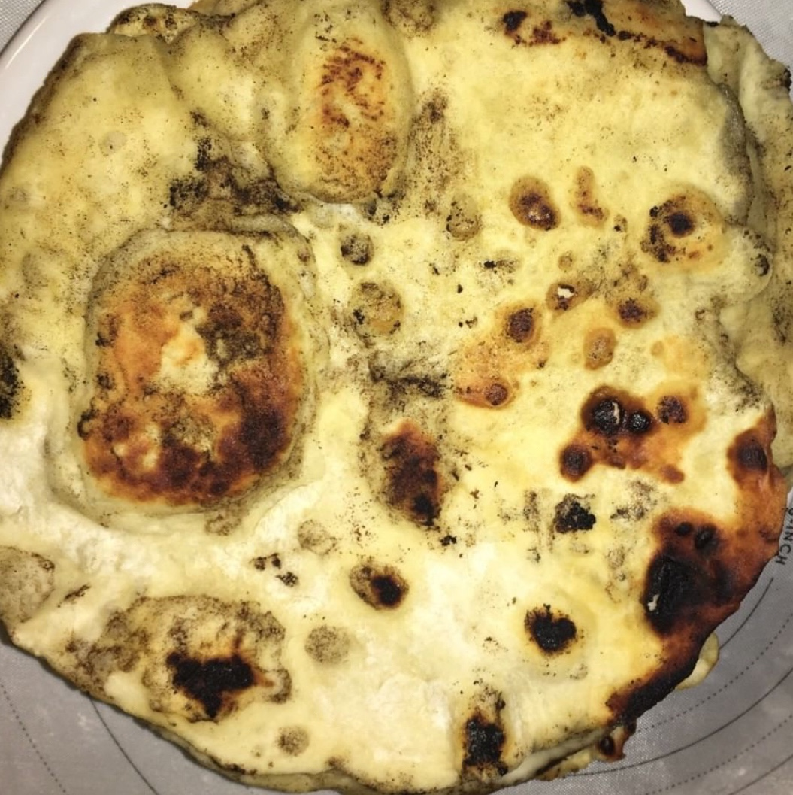

### Leírás

A [laffa](https://en.wikipedia.org/wiki/Laffa) egy közel-keleti száraz serpenyőben megsült kovászos lepény, melyet apróra vágott sült hússal, zöldségekkel, vagy éppen sajttal tölthetünk meg egy kiadós vacsorához.

### Hozzávalók

- 600g liszt
- 1 csomag élesztő (7g instant élesztő)
- 200ml langyos víz
- 2 kávés kanál cukor
- 3 kávés kanál só
- 100ml olaj

### instrukciók

1. Az élesztőt a vízbe morzsoljuk, hozzá adjuk a cukrot, néhány percre félre tesszük.

2. A lisztet tálba szitáljuk, belekeverjük a sót és az olajat.

3. Az élesztős langyos vizet a tálba öntjük.

4. Rugalmas tésztát gyúrunk, majd néhány percig dagasztjuk.

5. Kiolajozott tálban, egy *tiszta* konyharuvával letakarva fél órán át pihentetjük.

6. Ökölnyi méretű gömböket formázunk a tésztából

7. Újból pihentetjük 20 percig letakarva a gömböket.

8. Felforrósítjuk a serpenyőt.

9. A gömböket egy lisztezett gyúródeszkán kinyújtjuk.

10. A forró serpenyőben az egyik majd a mási oldalát megsütjük. **(Figyeljünk oda mert hamar megég, egy-egy perc elég)**

11. A megsütott laffát egy tányéron **nedves** konyharuvával letakarjuk.

